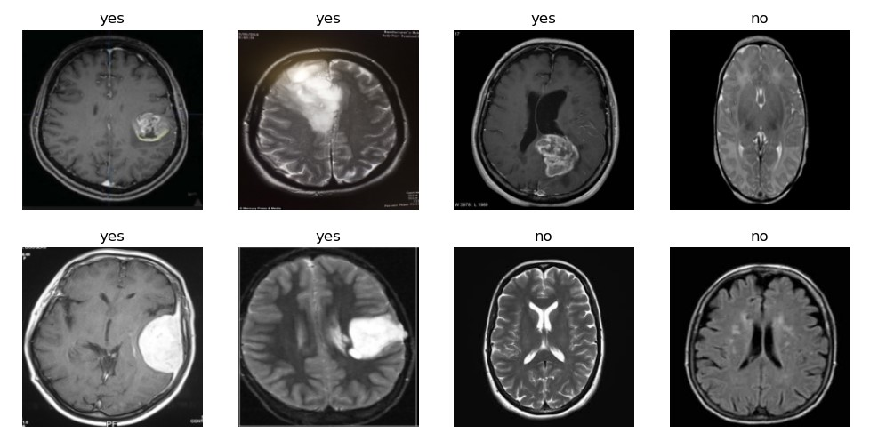

# Computer Vision for Brain Tumor Detection in MRI Images

- **Result:** 98% accuracy in classifying brain tumor from image
- **Train time:** 13s on GPU P100 accelerator, 3 epoch
- Model trained and saved in linux system 
- Prediction done on 2 random google images as an example, in windows system

